# web-datastructure-admin
## 项目介绍

This is a site for algorithm learning, which includes modules such as tutorial, animation, online exercise, forum.

此项目名为DataStructure.learner，目的是建立一个数据结构学习网站。网站共分为4大模块，tutorial教学模块、animation动画演示模块、exercise做题训练模块、forum论坛模块，主要涉及9种算法。本网站前端使用thymeleaf模板，后端使用springboot2.6.1+springcloud+mybatis实现，另外还利用了mysql、redis、druid、rabbitmq、spring security等技术来构建。

本项目使用spring cloud微服务技术提供用户做题训练的数据接口，作为`web-datastructure-esconsumer项目——用户做题训练可视化分析后台管理系统`的数据提供者。

## 项目演示

### 首页

主要分为sorting、linked list、hash table、binary search tree、graph traverval、minimum spanning tree、shortest path、cycle finding、basic concept九大算法。每个算法都有对应的tutorial教学模块、animation动画模块、exercise做题训练模块。

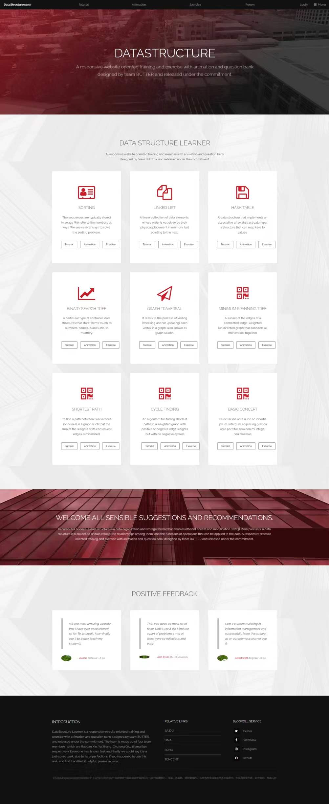

### 登录

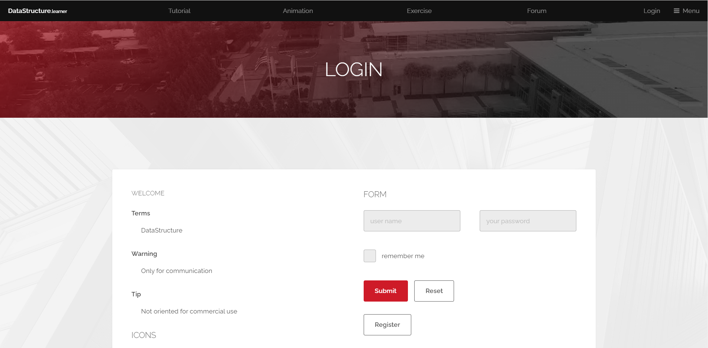

### 注册

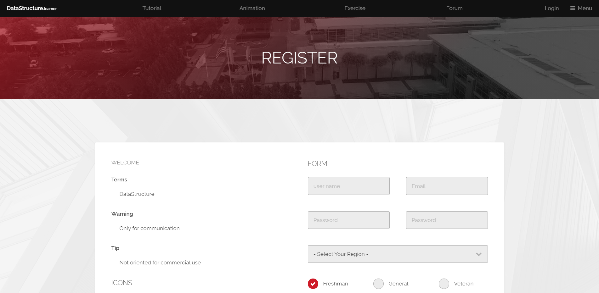


### tutorial教学模块-哈希表

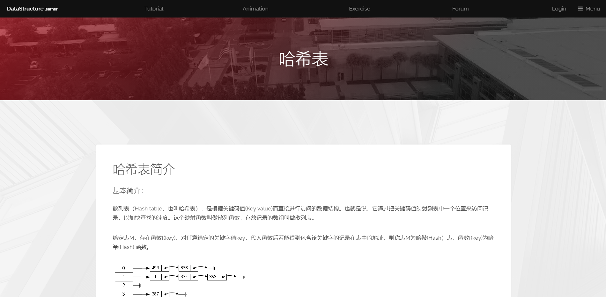

### animation动画模块

目前完成了4个算法的动画展示

#### sorting

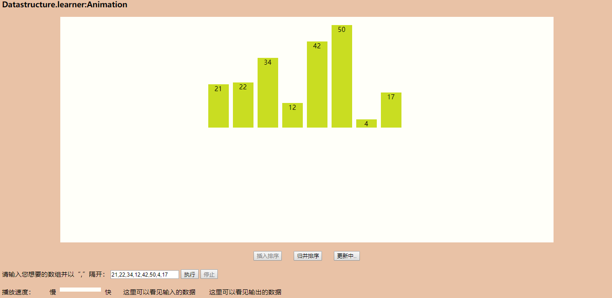

#### linked list

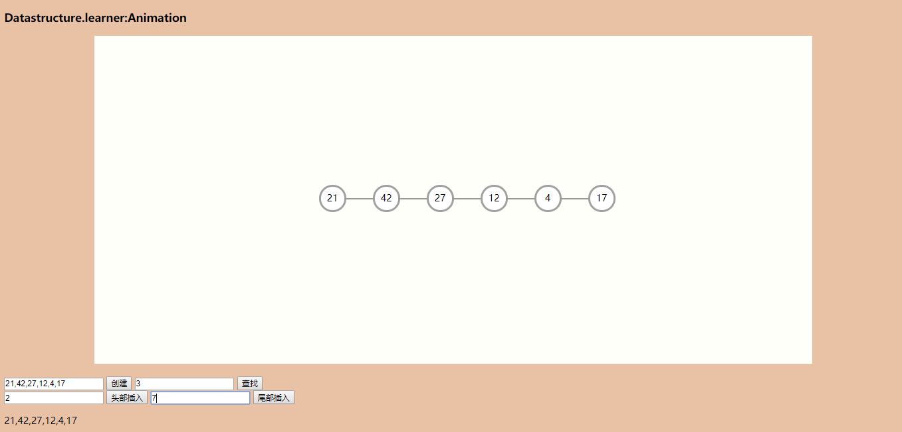

#### hash table

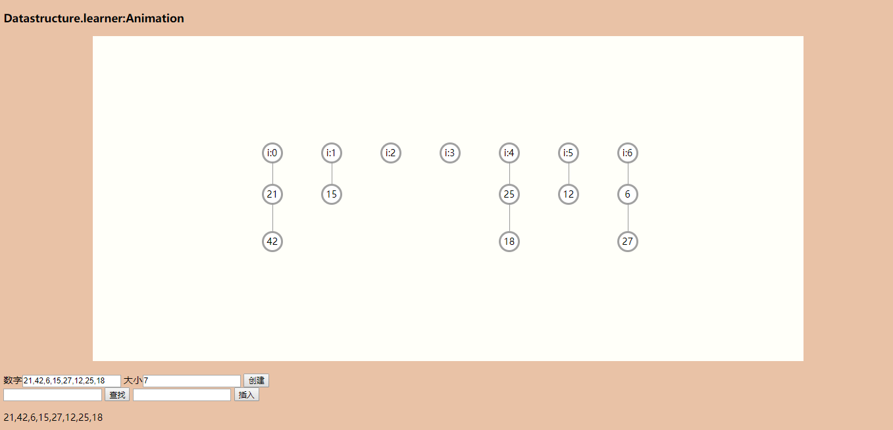

#### graph traversal

可选择开始遍历的节点、遍历方式

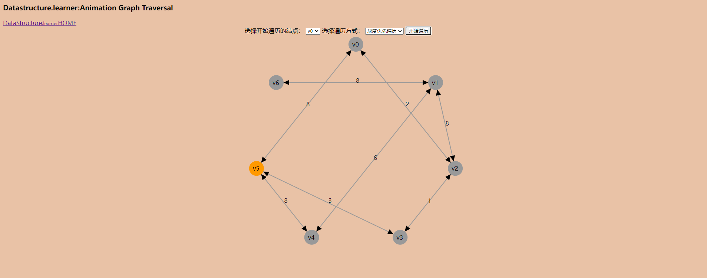

### exercise做题训练模块

#### exercise主页，用户选择章节、难度、题目数、时间

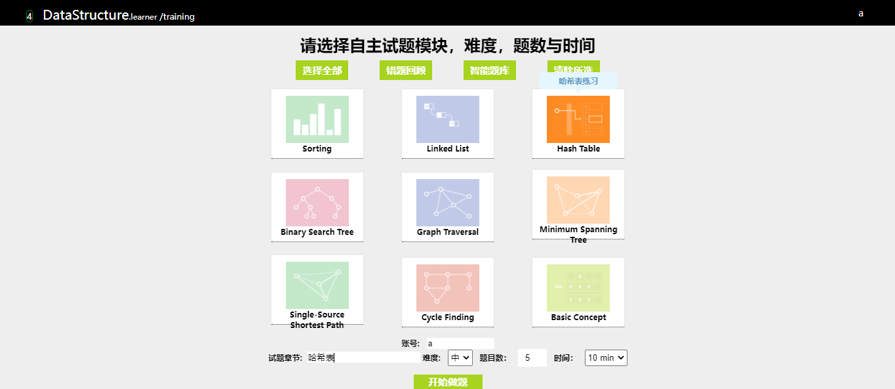

#### 具体做题页面

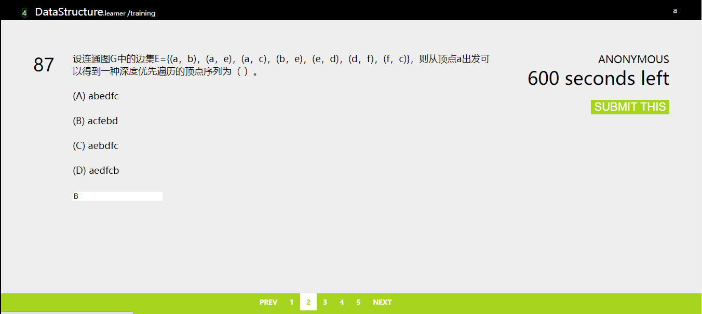

#### 做题结果告知页面

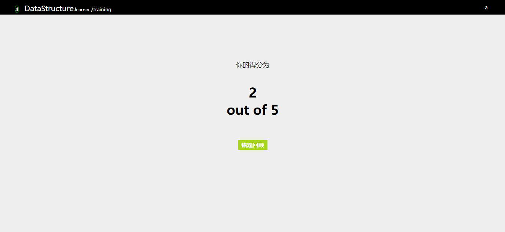

#### 错题回顾页面

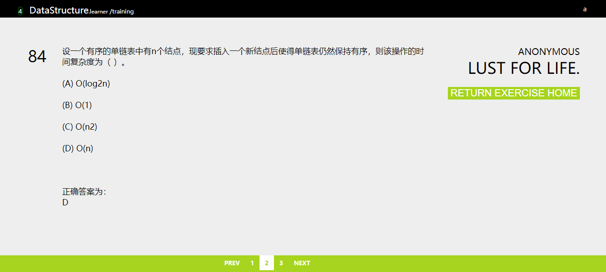

### forum模块

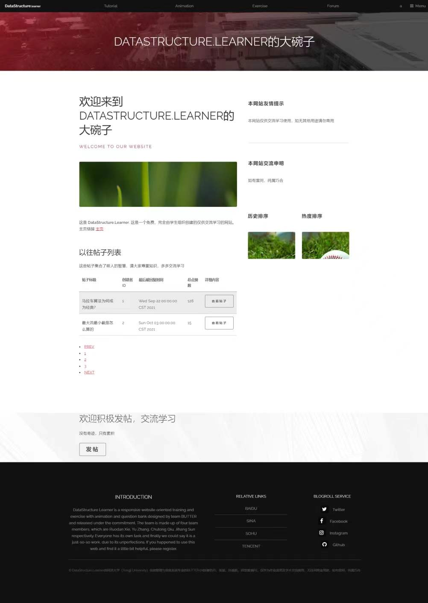

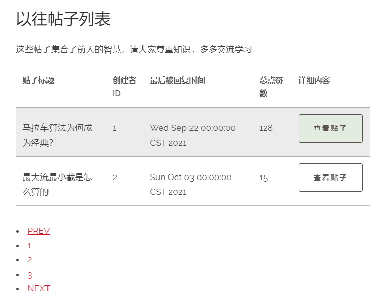

#### 查看具体贴子

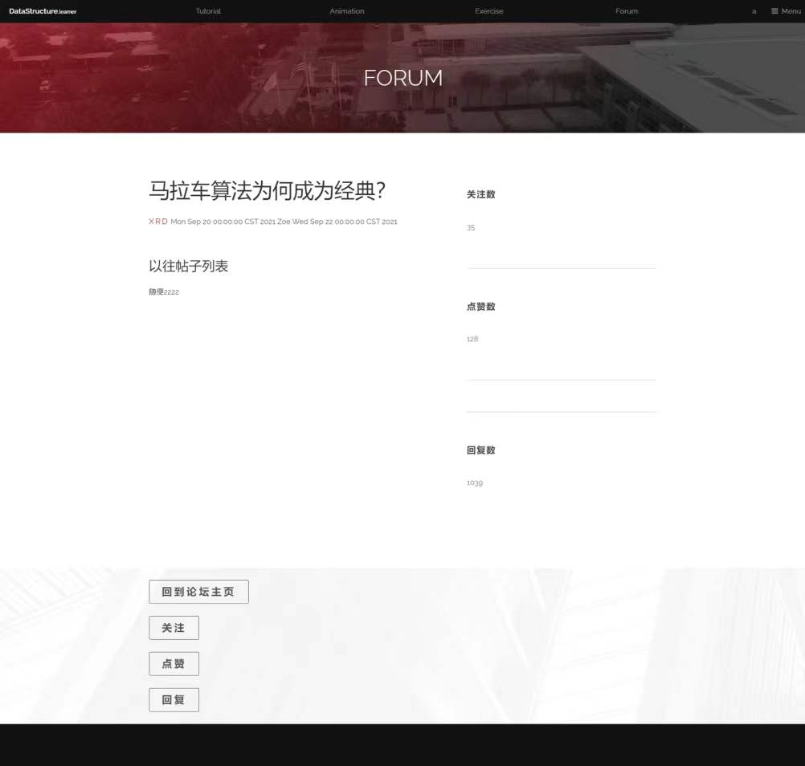

## 项目组织结构

web-datastructure-admin/src/main/java/com/butter/admin/

​    |----bean bean

​    |----config rabbitmq、redis缓存、security、mybatisplus配置

​    |----controller 业务逻辑

​    |----mapper 数据库操作

​    |----security spring security定制化操作

​    |----serivce 数据库操作

​    |----utils 工具类

## 数据库结构

```mysql
/**用户表**/
DROP TABLE IF EXISTS `user_tbl`;
CREATE TABLE `user_tbl`  (
  `id` bigint(0) NOT NULL AUTO_INCREMENT,
  `user_name` varchar(45) CHARACTER SET utf8 COLLATE utf8_bin NULL DEFAULT NULL,
  `password` varchar(45) CHARACTER SET utf8 COLLATE utf8_bin NULL DEFAULT NULL,
  `email` varchar(45) CHARACTER SET utf8 COLLATE utf8_bin NULL DEFAULT NULL,
  `roles` varchar(45) CHARACTER SET utf8 COLLATE utf8_bin NULL DEFAULT NULL,
  PRIMARY KEY (`id`) USING BTREE
) ENGINE = InnoDB AUTO_INCREMENT = 15 CHARACTER SET = utf8 COLLATE = utf8_bin ROW_FORMAT = Dynamic;


/**论坛贴子记录表**/
DROP TABLE IF EXISTS `forum_thread_tbl`;
CREATE TABLE `forum_thread_tbl`  (
  `thread_id` bigint(0) NOT NULL AUTO_INCREMENT,
  `title` varchar(45) CHARACTER SET utf8 COLLATE utf8_general_ci NULL DEFAULT NULL,
  `content` varchar(45) CHARACTER SET utf8 COLLATE utf8_general_ci NULL DEFAULT NULL,
  `creator_id` bigint(0) NULL DEFAULT NULL,
  `created_time` datetime(0) NULL DEFAULT NULL,
  `follow_count` int(0) NULL DEFAULT NULL,
  `upvote_count` int(0) NULL DEFAULT NULL,
  `reply_count` int(0) NULL DEFAULT NULL,
  `last_answered_at` datetime(0) NULL DEFAULT NULL,
  `last_answered_by` varchar(45) CHARACTER SET utf8 COLLATE utf8_general_ci NULL DEFAULT NULL,
  PRIMARY KEY (`thread_id`) USING BTREE
) ENGINE = InnoDB AUTO_INCREMENT = 6 CHARACTER SET = utf8 COLLATE = utf8_general_ci ROW_FORMAT = Dynamic;


/**做题训练板块的所有题目的信息表**/
DROP TABLE IF EXISTS `choice_question_tbl`;
CREATE TABLE `choice_question_tbl`  (
  `qID` bigint(0) NOT NULL AUTO_INCREMENT,
  `qContent` longtext CHARACTER SET utf8 COLLATE utf8_general_ci NULL,
  `aChoice` longtext CHARACTER SET utf8 COLLATE utf8_general_ci NULL,
  `bChoice` longtext CHARACTER SET utf8 COLLATE utf8_general_ci NULL,
  `cChoice` longtext CHARACTER SET utf8 COLLATE utf8_general_ci NULL,
  `dChoice` longtext CHARACTER SET utf8 COLLATE utf8_general_ci NULL,
  `qAnswer` longtext CHARACTER SET utf8 COLLATE utf8_general_ci NULL,
  `qLevel` bigint(0) NULL DEFAULT NULL,
  `qSection` longtext CHARACTER SET utf8 COLLATE utf8_general_ci NULL,
  PRIMARY KEY (`qID`) USING BTREE
) ENGINE = InnoDB AUTO_INCREMENT = 281 CHARACTER SET = utf8 COLLATE = utf8_general_ci ROW_FORMAT = Dynamic;


/**用户选择了章节、难度、题目数、时间，保存用户本次选择的试卷信息**/
DROP TABLE IF EXISTS `exercise_record_tbl`;
CREATE TABLE `exercise_record_tbl`  (
  `er_id` bigint(0) NOT NULL AUTO_INCREMENT,
  `user_id` int(0) NULL DEFAULT NULL,
  `section` longtext CHARACTER SET utf8 COLLATE utf8_general_ci NULL,
  `level` longtext CHARACTER SET utf8 COLLATE utf8_general_ci NULL,
  `question_num` int(0) NULL DEFAULT NULL,
  `time` int(0) NULL DEFAULT NULL,
  PRIMARY KEY (`er_id`) USING BTREE
) ENGINE = InnoDB AUTO_INCREMENT = 774 CHARACTER SET = utf8 COLLATE = utf8_general_ci ROW_FORMAT = Dynamic;


/**用户在做题训练模块做的每一道题的记录表**/
DROP TABLE IF EXISTS `choice_question_record_tbl`;
CREATE TABLE `choice_question_record_tbl`  (
  `cqr_id` bigint(0) NOT NULL AUTO_INCREMENT,
  `er_id` bigint(0) NULL DEFAULT NULL,
  `user_id` bigint(0) NULL DEFAULT NULL,
  `q_id` bigint(0) NULL DEFAULT NULL,
  `isright` tinyint(0) NULL DEFAULT NULL,
  `users_answer` longtext CHARACTER SET utf8 COLLATE utf8_general_ci NULL,
  PRIMARY KEY (`cqr_id`) USING BTREE
) ENGINE = InnoDB AUTO_INCREMENT = 184 CHARACTER SET = utf8 COLLATE = utf8_general_ci ROW_FORMAT = Dynamic;
```

## E-R图

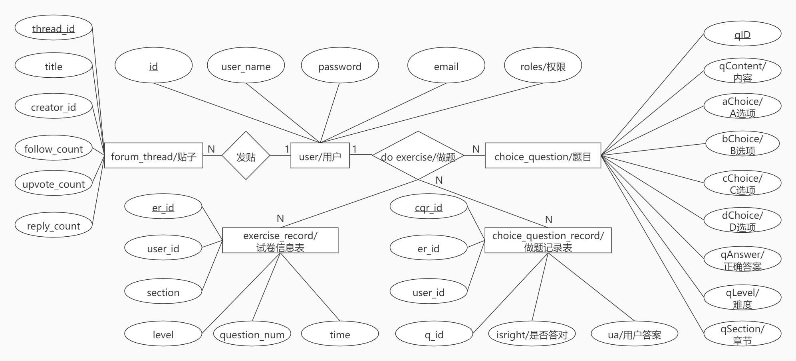

## 技术选型

| 技术                      | 说明                             |
| ------------------------- | -------------------------------- |
| SpringBoot                | 容器+MVC框架                     |
| SpringCloud-Netflix       | eureka注册中心                   |
| MyBatis                   | ORM框架                          |
| MyBatisPlus               | ORM框架                          |
| RabbitMQ                  | 消息队列（做题数据的传送与接收） |
| MySQL                     | 数据库                           |
| Druid                     | 数据库连接池、sql 防火墙监控等   |
| Redis                     | 缓存（用户信息）                 |
| SpringSecurity            | 认证和授权框架                   |
| Thymeleaf                 | 前端模板                         |
| Thymeleaf-springsecurity5 | 前端认证模板                     |
| Lombok                    | 简化对象封装工具                 |
| Devtools                  | 部署                             |

## 开发环境

| 工具               | 版本号            |
| ------------------ | ----------------- |
| JDK                | 1.8               |
| MySQL              | 8.0.27            |
| Redis              | 6.2.6             |
| SpringBoot         | 2.6.1             |
| SpringCloudNetflix | 3.1.0             |
| RabbitMQ           | 3.9.11-management |
| MyBatis            | 2.2.0             |
| MyBatisPlus        | 3.4.3             |
| Druid              | 1.1.17            |

## 搭建步骤

> 在docker/本地安装mysql、redis、rabbitmq
>
> clone web-datastructure-esserver项目，启动
>
> clone web-datastructure-admin项目，启动

## 项目说明

本项目原本为一个小组作业合作项目，本人谢若丹主要负责网站后端搭建、数据库搭建、做题训练模块、论坛模块，张瑜、孙基航同学负责动画演示模块、邱楚童和谢若丹同学一起负责教学模块资料收集与展示，当时使用的技术为css+javascript+html+java。

现使用springboot技术及相关技术对原有项目进行优化。

## 联系作者

大家有任何建议和反馈都可以在issue种反馈，我会慢慢完善。

我的邮箱：xieruodan@126.com


